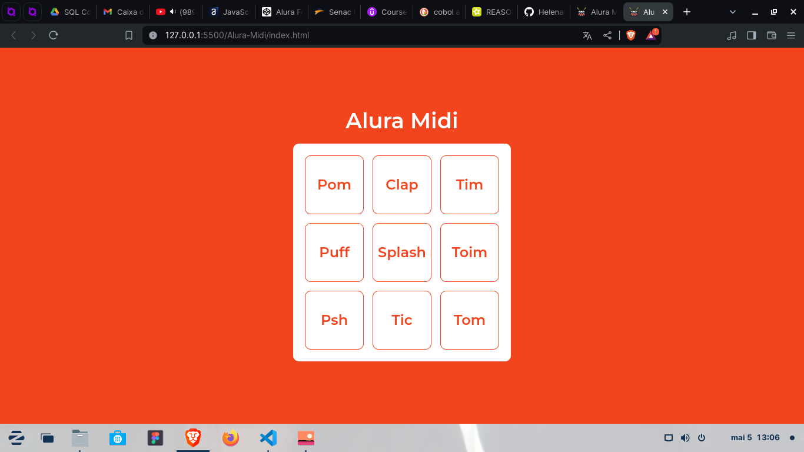

# Alura-Midi
### Curso: JavaScript para Web - Crie páginas dinâmicas
> ACESSE: https://helenaoliveira366.github.io/Alura-Midi/
 

Projeto e curso finalizados!

Reprodutor de sonos com JavaScript, foram aplicados conceitos como:

<ul>
  <li>Template Strings para criação de id dinâmico</li>
  <li>Estrutura condicional if/else</li>
  <li>Estrutura de repetição while e for</li>
  <li>Funções anônimas</li>
  <li>Eventos de click</li>
  <li>Propriedades e valores de elemntos HTML</li>
</ul>
 

